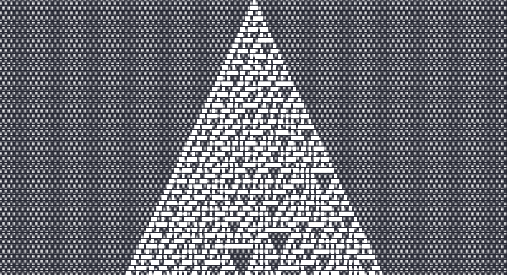
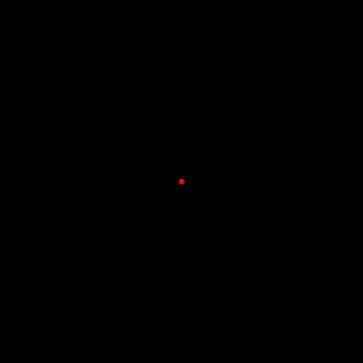
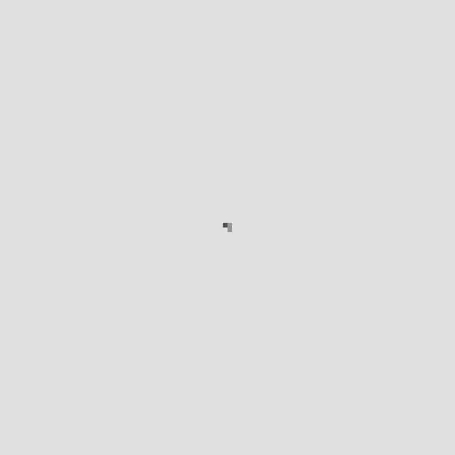
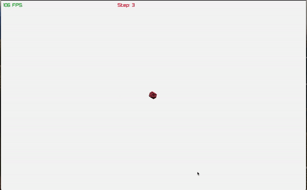

# gotomata
A parallelized, sparse grid framework for working with cellular automata inspired by Steven Wolfram's _A New Kind Of Science_.

The three dimensional cellular automata were inspired by the very excellent [softology blog post](https://softologyblog.wordpress.com/2019/12/28/3d-cellular-automata-3/).
3d rendering of the cellular automata is done here as well.
I know nothing about rendering and basicially copied the code from [Raylib-go](https://github.com/gen2brain/raylib-go) outright.
In particular, I used their shaders from the [mesh_instancing](https://github.com/gen2brain/raylib-go/tree/master/examples/shaders/mesh_instancing/glsl330) example.

## How it works

A grid of cells is sharded based on the number of CPU's your machine has.
This allows for parallel computation of the next state of the grid based on the specified neighborhood and ruleset functions.

When instantiating a grid, you specify a default state which allows the grid to be sparse.
Only cells that are not the default state will be stored across the shards.

Just about any grid type should be supported because all a coordinate is, is a list of integers.
Thus, you define what a coordinate means. For a typical 2 dimensional square grid, this is the standard (x,y) coordinate pair.
But you can just as easily use hexagonal coordinates (q,r) because neighbors are computed by a user defined function.
(The geometry of the grid is essentially determined on read instead of hardcoded)

Thanks to go generics, cells store arbitrary data allowing for complex automata.
Mostly commonly booleans can be used to store on/off states, but ints can be used to model several states.
Much more complex states can also be represented using custom structs provided they implement the necessary methods to make the comparable.

## Visualizations

### The famous rule 30

### Hexagonal Growth

### Sample Conway Game of Life

## Random Walk

## 3D (Still a work in progress)

